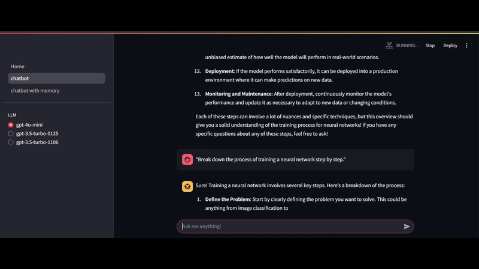

# 🤖 Context-Aware Chatbot Using Streamlit, LangChain, and Buffer Memory

Building intelligent and context-aware chatbots is an exciting challenge. With the power of **Streamlit**, **LangChain**, and **Buffer Memory**, you can create a chatbot that not only understands the context of conversations but also offers insightful and personalized responses. In this brief guide, I’ll walk you through the key components and how to build a simple context-aware chatbot.

---

## Key Components 🛠️

### 1. **LangChain** 🧩
LangChain is a framework for creating applications powered by large language models (LLMs). It allows easy chaining of operations like processing inputs, generating outputs, and integrating external APIs.

### 2. **Buffer Memory** 🧠
Buffer memory helps the chatbot remember recent exchanges, allowing it to maintain context throughout a conversation. This is especially important when building conversational agents that need to recall past interactions, ensuring a coherent and seamless user experience.

### 3. **Streamlit** 🌐
Streamlit is an easy-to-use framework for building interactive web apps. In this project, we use Streamlit to build a front-end interface, making it simple for users to interact with the chatbot.

---

## Building the Chatbot 🛠️

### 1. **Setting Up the Project** 
Start by cloning the LangChain repository and installing the required dependencies.

Next, set up your **OpenAI API key** in a `.env` file for model access.

### 2. **Creating a Context-Aware Bot**  
LangChain allows you to define a **PromptTemplate** that gives the bot a specific persona. For example, you can create a neural network expert persona, which ensures that responses remain focused and contextually relevant.

### 3. **Using Buffer Memory**  
Buffer memory allows the chatbot to retain recent interactions, making conversations feel more natural. LangChain’s buffer memory can remember a set number of exchanges, ensuring that the chatbot adapts its responses based on previous queries.

---

## Running the Chatbot 🚀

Once everything is set up, you can run the chatbot app using Streamlit. The app will open in your browser, and you can interact with your context-aware chatbot. It will remember prior interactions and adapt to provide better, more personalized answers.

---

## Conclusion 🎉

With **LangChain**, **Buffer Memory**, and **Streamlit**, you can create powerful, context-aware chatbots that provide intelligent responses in real-time. Whether you're building a technical expert bot or a general-purpose assistant, these tools provide a robust foundation for developing sophisticated conversational agents.

